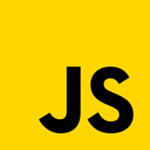
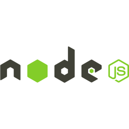

# prof. Marnei Cardoso - YouTube

#### Buenas! Meu propósito é te ajudar a trabalhar com o que ama e ainda ganhar uma boa grana!
#### Boora transformar sonho em carreira?
#### Let’s Rock! 🚀

---

### Marnei Cardoso - Professor e Desenvolvedor

Desenvolvimento Web do zero, com aulas práticas, didática simples e foco em quem está iniciando. Acompanhe os vídeos, refaça os projetos e compartilhe suas dúvidas e conquistas!

---
🚀 <a href="https://www.youtube.com/@profMarneiCardoso?sub_confirmation=1" target="_blank">Canal no YouTube</a>  

📷 <a href="https://www.instagram.com/prof.marnei.cardoso" target="_blank">Instagram</a>  

📢 <a href="https://www.linkedin.com/in/marneicardoso" target="_blank">LinkedIn</a>  

--- 
### Desenvolvimento Web com as principais linguagens e ferramentas do mercado.

## Front-End:

Linguagem de marcação usada para estruturar conteúdo das páginas Web.

---

Linguagem para estilizar páginas Web (cores, fontes, layouts, animações, responsividade).

---

Linguagem de programação usada para interatividade e lógica no Front-End e Back-End.

---

Biblioteca JavaScript para construção de interfaces reativas e escaláveis.

## Back-End

Linguagem de Back-End, usada para gerar páginas dinâmicas no servidor.

---

Ambiente para rodar JavaScript no servidor. Ideal para APIs e aplicações modernas.

---

Sistema de Banco de Dados Relacional, amplamente utilizado em sistemas Web.

---

ORM moderno para Node.js que facilita a interação com Bancos de Dados Relacionais.

## Controle de Versão

Sistema de controle de versão que permite salvar e rastrear mudanças no código.

---

Plataforma para hospedar, compartilhar e versionar projetos usando Git.

## Design

  

Ferramenta para design de interfaces, ideal para prototipagem e colaboração.
